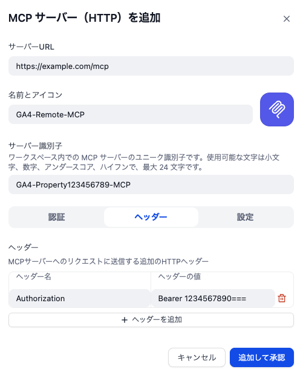
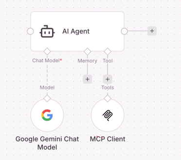

[English](./README.md) | 日本語

# ga4-remote-mcp

Google 公式の GA4 MCP（[google-analytics-mcp](https://github.com/googleanalytics/google-analytics-mcp)）をリモート MCP（HTTP）化した、非公式プロジェクトです。
公式 MCP をベースにしており、データはユーザーが明確に指定した MCP サーバーや LLM などにのみ送信され、指定していない外部に送信されることはありません。


## このツールでできること

GA4 のデータを使った AI チャットボットや自動レポートを、Dify・n8n・Slack などと組み合わせて作れます。

| できること | 例 |
| --- | --- |
| チームで共有 | サーバー 1 台を立てれば、メンバー全員が同じ AI 分析環境を使える。PC ごとのインストール不要 |
| 定期レポートの自動化 | 「週末に先週との変化をAIがレポート作って Slack に投稿」するワークフローを作る |
| GA4 の権限がない人でも分析 | Slack ボットや社内チャットから自然言語で聞けるので、GA4 にログインできなくても使える。サーバーから読み取れる GA4 プロパティは `GA4MCP_ALLOWED_PROPERTY_IDS` で管理者がサーバー側で制限する（[セキュリティに関する注意](#セキュリティに関する注意) 参照） |
| 自然言語で GA4 に質問 | 「流入元別の分析をして」や「季節変動を除いた過去半年の分析をして」と聞くだけで回答が返る |


### 公式 MCP との違い

| | Google 公式 GA4 MCP | ga4-remote-mcp（このプロジェクト） |
| --- | --- | --- |
| 接続方式 | ローカル（stdio） | リモート（HTTP） |
| 利用場所 | インストールした PC で動く | Dify・n8n・Slack ボットなど、HTTP が届く場所ならどこからでも |
| チーム利用 | 各自がインストール | サーバー 1 台でチーム共有可能 |
| 自動化 | インストールしたPC内で可能 | クラウドから実行可能なので、n8n や Dify のワークフローで利用できる |

> stdio（標準入出力）での接続には対応していません。HTTP 接続専用です。


---

## この README の読み方

あなたの役割によって、読むべきセクションが違います。

| あなたの役割 | 読むところ |
| --- | --- |
| 利用者（マーケター・ディレクターなど）URL とトークンをもらって Dify / n8n を設定する人 | [利用者ガイド](#利用者ガイド) → [Dify で使う場合の例](#dify-で使う場合の例) or [n8n で使う場合の例](#n8n-で使う場合の例) |
| 管理者（エンジニア）サーバーを立てて URL とトークンを発行する人 | [管理者ガイド](#管理者ガイドサーバー構築) → 利用者にも目を通す |


---

## 利用者ガイド

> 管理者（エンジニア）にサーバーを立ててもらうと、以下の情報がもらえます。設定手順は複雑に見えるかもしれませんが、AI（ChatGPT・Gemini など）に手順を見せながら聞けば、一つずつ進められます。

### 事前に準備するもの

| 準備するもの | 説明 | 誰が用意するか |
| --- | --- | --- |
| MCP サーバーの URL | Dify / n8n に入力する接続先。 | 管理者からもらう |
| Bearer トークン | 認証用の文字列（パスワードのようなもの） | 管理者からもらう |
| GA4 プロパティ ID | 分析対象のプロパティの数値。 | GA4を見て確認 |
| AI モデルの API キー | MCPから取得データを分析するための AIをAPIから利用できるにする必要があります。GeminiやClaude、GPTなど、利用しやすいものを準備してください。 | 自分で契約・取得するか、管理者に相談してください。無料APIは、学習利用されることがあるので業務用としては非推奨です。 |


---

## Dify で使う場合の例

Dify の Tools → MCP → Add MCP Server (HTTP) から登録します。
（日本語 UI では「ツール → MCP → MCP サーバーを追加」）



### 手順

1. DIfyの Tools → MCP → Add MCP Server (HTTP) を選ぶ
2. Server URL に、管理者からもらった URL を入力する
3. Name と Server ID を入力する（名前は自由に設定できますが、Server ID は一度決めたら変更しないこと）
4. 認証→ヘッダーを選択して、以下を設定する
   - 名前: `Authorization`
   - 値: `Bearer ＜トークン＞`（トークンの値の前に`Bearer` という文字列と半角スペース 1 つ入ります）
5. 保存して、ツール一覧が表示されることを確認する
6. チャットまたはワークフローからツールを呼べるか試してください

### エージェントのシステムプロンプト（推奨）

AI の精度を上げるため、システムプロンプトを設定することをおすすめします。

- システムプロンプトの例: [docs/dify-system-prompt-ga4-mcp-tools.md](./docs/dify-system-prompt-ga4-mcp-tools.md)
- 自由に設定できますが、例を参考にしてください。
- プロパティ固有、組織固有の質問に答えられるような情報を追記することをおすすめします。

### Dify でよくあるエラー

#### 「Failed to discover OAuth metadata from server」

`Authorization` の値が `Bearer ＜トークン＞` になっているか確認してください。

#### Bearer が 403 になる

- `Authorization` の値が `Bearer ＜トークン＞` になっているか確認
- 行末に `%` が入っていたら、コピーミスです。行末の%はトークンの一部ではありません
- 末尾 `=` はトークンの一部なので削らないこと


---

## n8n で使う場合の例



※ノード名や設定名は日々変わるので、最新の情報を確認してください。

### 手順

1. Credentials で Bearer を選びトークンを入力する。
2. Credentials で API利用するAIの接続設定をする。
3. AIエージェントノードに MCP Client、AIモデル(会話モデル)の2つのノードを接続してワークフローに配置する
4. MCP Client に手順1のCredentialsを設定し、Server URL に管理者からもらった URL を入力。
5. AIモデル(会話モデル)に手順2のCredentialsを設定。
6. AIエージェントノードにユーザープロンプトとシステムプロンプトを設定する。
   システムプロンプトの例: [docs/dify-system-prompt-ga4-mcp-tools.md](./docs/dify-system-prompt-ga4-mcp-tools.md)
7. 必要な他のノードを設定(Slackから入力を受ける等)してテストしてください。


---

## 管理者ガイド（サーバー構築）

> このセクションはサーバーを構築・運用するエンジニア向けです。
> もし、あなたがエンジニアではないマーケターやPdMなら、AIにこの内容を読み込ませて、AIとあなたが共同作業することでも実現できるはずです。専門知識がなくても実装できます。

### 認証の全体像

| 何の認証か | どこに設定するか | 方法 |
| --- | --- | --- |
| MCP サーバー → GA4 | MCP サーバーの環境変数 | `GOOGLE_APPLICATION_CREDENTIALS` にサービスアカウント JSON のパスを指定。Cloud Run なら Workload Identity / ADC 推奨 |
| Dify / n8n → MCP サーバー | サーバーとクライアントの両方 | サーバー: `GA4MCP_AUTH_MODE=bearer` + `GA4MCP_BEARER_TOKEN`。クライアント: `Authorization: Bearer ＜同じトークン＞`。 |
| AI モデル（LLM） | Dify / n8n 側 | Dify の「モデルプロバイダー」や n8n の LLM ノードで API キーを設定 |

### サーバー起動前の準備

1. サーバーを起動し、HTTPS（推奨）または HTTP でアクセスできるようにする
2. 環境変数を設定する。
   - `GA4MCP_BEARER_TOKEN`: `./scripts/generate-bearer-token.sh` で生成（`bearer` モードで空だと起動しない）
   - `GA4MCP_BEARER_FAILURE_HTTP_STATUS=403`: Dify 連携時に推奨
   - `GA4MCP_ALLOWED_PROPERTY_IDS`: 許可するプロパティ ID（カンマ区切り）
3. 本番環境では `GA4MCP_ALLOWED_HOSTS` を設定する（DNS リバインディング対策。未設定だと接続がすべて失敗することがある）

### Docker で動かす

```bash
docker build -t ga4-remote-mcp .
docker run --rm -p 8080:8080 \
  -e GA4MCP_ENV=production \
  -e GA4MCP_AUTH_MODE=bearer \
  -e GA4MCP_BEARER_TOKEN=＜./scripts/generate-bearer-token.sh の出力＞ \
  -e GA4MCP_BEARER_FAILURE_HTTP_STATUS=403 \
  -e GA4MCP_ALLOWED_HOSTS=＜クライアントが送る Host と同じ値＞ \
  -e GOOGLE_APPLICATION_CREDENTIALS=/secrets/sa.json \
  -v /path/to/sa.json:/secrets/sa.json:ro \
  ga4-remote-mcp
```

### Cloud Run で動かす例

詳細: [docs/deploy-cloud-run.md](./docs/deploy-cloud-run.md) / [scripts/deploy-cloud-run.sh](./scripts/deploy-cloud-run.sh)

| 区分 | 必要なもの |
| --- | --- |
| GCP | デプロイ先プロジェクト、請求の有効化、API（Cloud Run、Cloud Build、Artifact Registry、Secret Manager） |
| ランタイム SA | Cloud Run に紐づけるサービスアカウント。GA4 プロパティに閲覧権限、必要に応じて Analytics Admin API が使えること。JSON 鍵よりも Workload Identity / ADC 推奨 |
| 環境変数 | `GA4MCP_ENV=production`、`GA4MCP_ALLOWED_PROPERTY_IDS`、本番では `GA4MCP_ALLOWED_HOSTS` |
| Bearer（本番では必須） | `GA4MCP_AUTH_MODE=bearer` + Secret Manager にトークン格納。`GA4MCP_ENV=production` + `GA4MCP_AUTH_MODE=none` の組み合わせは起動を拒否します。Dify 連携では `GA4MCP_BEARER_FAILURE_HTTP_STATUS=403` 推奨 |
| デプロイ操作 | `./scripts/deploy-cloud-run.sh` を実行。`GCP_PROJECT_ID`、`GA4MCP_ALLOWED_PROPERTY_IDS`、`CLOUD_RUN_SERVICE_ACCOUNT`（推奨）、`GA4MCP_BEARER_SECRET_NAME`（必須・未設定の場合スクリプトが起動前に失敗する）を export |

デプロイ後、`gcloud run services describe` で公開 URL を確認し、`https://＜ホスト＞/mcp` を利用者に共有します。


---

## セキュリティに関する注意

このサーバーはパブリックインターネット上にデプロイされる前提で設計されています（推奨経路は Cloud Run + `--allow-unauthenticated`）。**信頼境界はサーバー側で担保**しており、エージェントのプロンプトではありません。

### データを守っている層

| レイヤー | 内容 | 設定 |
| --- | --- | --- |
| 認証 | `Authorization: Bearer <token>` を `hmac.compare_digest` で定数時間比較 | `GA4MCP_AUTH_MODE=bearer` + `GA4MCP_BEARER_TOKEN` |
| 認可 | リクエスト単位で GA4 プロパティ許可リストを検証。リスト外のプロパティは Google に到達する前に拒否 | `GA4MCP_ALLOWED_PROPERTY_IDS` |
| 本番ガード | `GA4MCP_ENV=production` + `GA4MCP_AUTH_MODE=none` の組み合わせは起動を拒否するため、認証なしの公開デプロイは事故では発生しない | 起動時に強制 |
| ネットワーク | 本番では `Host` ヘッダ許可リストで DNS リバインディング対策 | `GA4MCP_ALLOWED_HOSTS` |
| エラー応答 | 内部例外はクライアントには汎用的な `internal_error` にマップし、詳細はサーバーログにのみ出力 | `errors/normalize.py` で強制 |

### データを守っていないもの

- **エージェントやシステムプロンプトはセキュリティ境界ではありません。** MCP ツールに渡された入力は、このサーバーが完全な権限で実行します。利用者（またはエージェントが呼ぶ別ツール）はモデルにプロンプト上の制約を無視させられるため、「システムプロンプトでプロパティやフィールドを隠す」運用に頼らないでください。代わりに `GA4MCP_ALLOWED_PROPERTY_IDS` を使ってください。
- **エンドユーザーに渡した Bearer トークンは、許可リスト内すべてのプロパティへの直接アクセスを渡したのと同じ意味になります。** 強い分離が必要な場合はテナントごとに別のトークン（Cloud Run サービスを分けるか、少なくとも許可リストを分ける）を発行してください。

### 脆弱性の報告

[SECURITY.md](./SECURITY.md) を参照してください。


---

## ライセンス・開発者向け情報

- ライセンス: Apache License 2.0（[LICENSE](./LICENSE)）。Google 公式 [google-analytics-mcp](https://github.com/googleanalytics/google-analytics-mcp) 由来部分は [NOTICE](./NOTICE)
- Cloud Run デプロイ: [docs/deploy-cloud-run.md](./docs/deploy-cloud-run.md) / [scripts/deploy-cloud-run.sh](./scripts/deploy-cloud-run.sh)
- ローカル開発: Python 3.10+。`pip install -e ".[dev]"` で依存をインストール、`pytest` / `ruff` で検証（`pyproject.toml` 参照）

### 運用メモ

- グレースフルシャットダウン: Uvicorn に `timeout_graceful_shutdown=30` 秒を指定。Kubernetes では `terminationGracePeriodSeconds` を 45〜60 程度に設定
- ログと個人関連データ: 構造化ログに接続元 IP が含まれることがあります。保持期間・アクセス制御・GDPR 等はデプロイ・運用側の責務です

---

*Issue や Pull Request での改善提案を歓迎します。*
